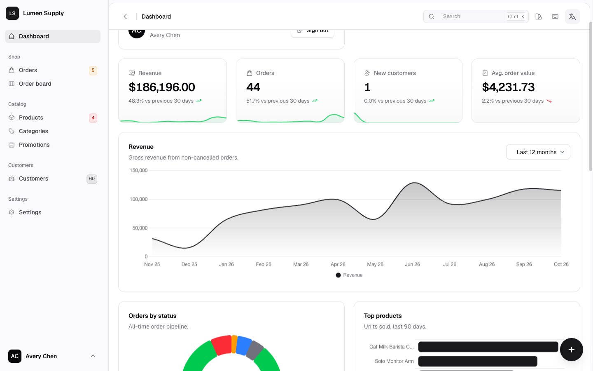
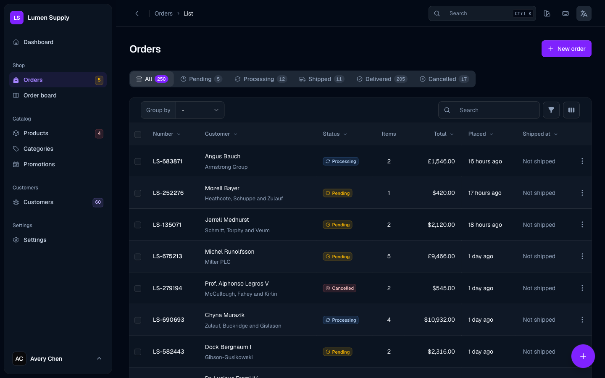
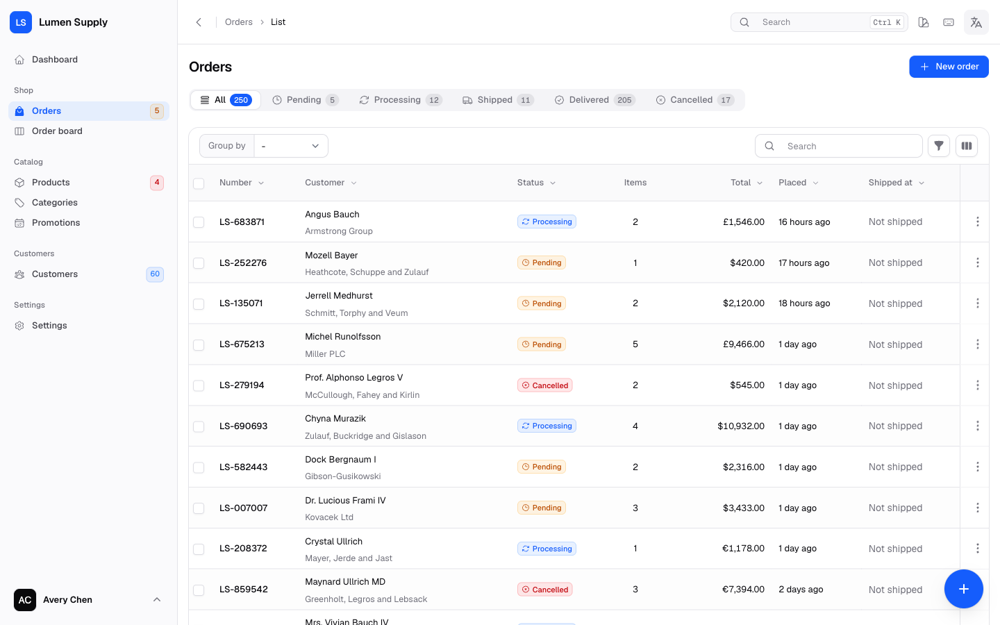
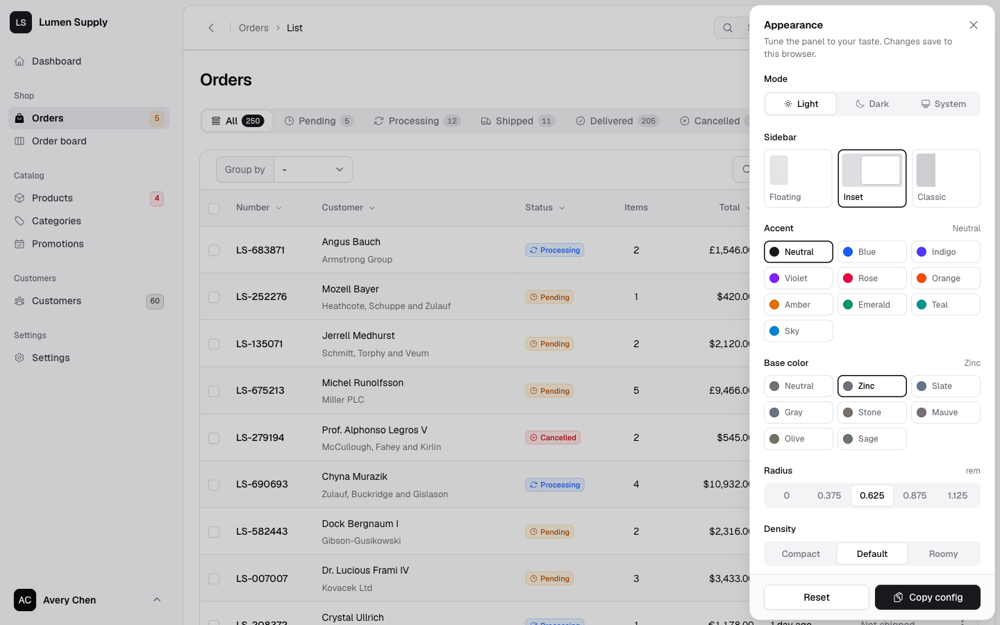
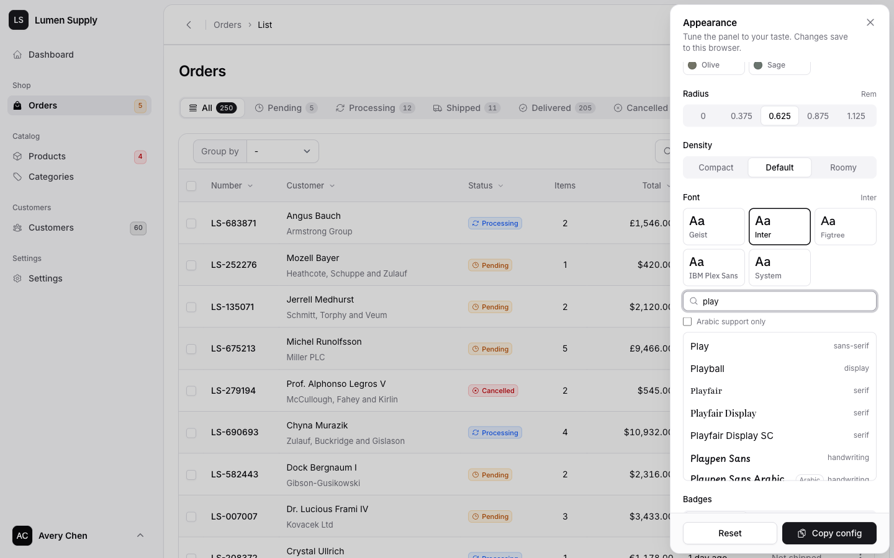
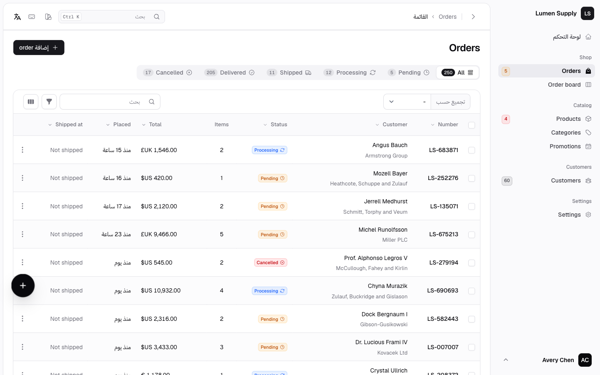
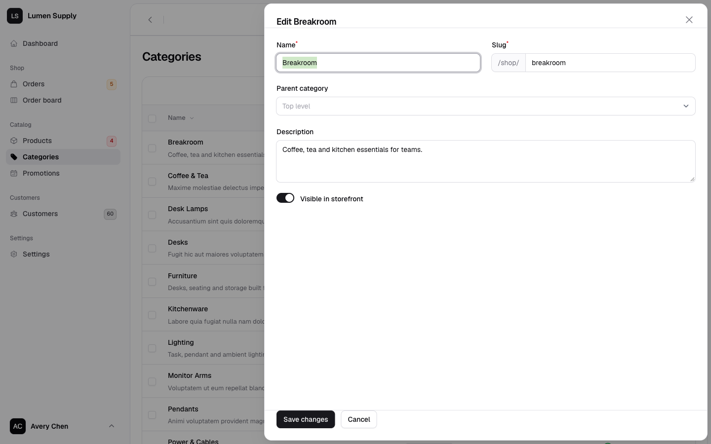
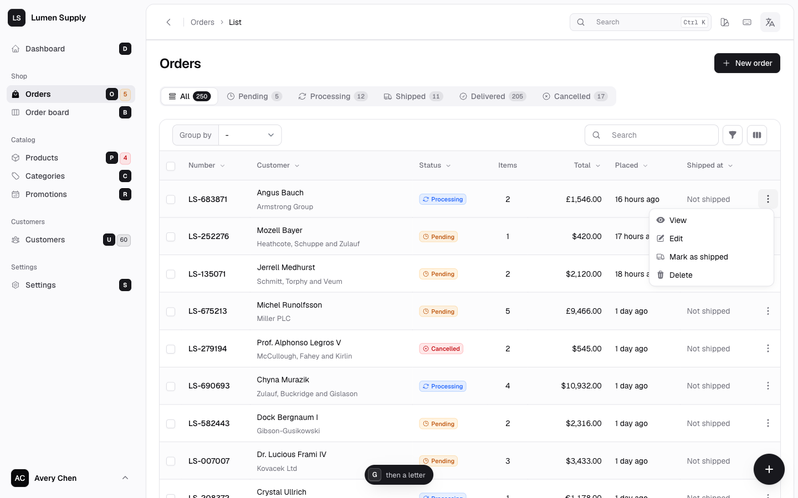
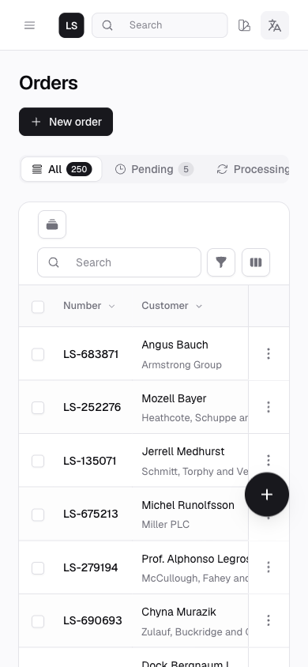

# Monolith

A shadcn-style theme for Filament v4 and v5. Quiet surfaces, tight typography, first-class light, dark and RTL, any font, and a live appearance customizer your users can tune without a rebuild.



| | |
| --- | --- |
|  |  |
|  |  |
|  |  |
|  |  |

## Installation

```bash
composer require hoceineel/filament-monolith
php artisan filament:assets
```

Register the plugin on a panel. Monolith sets the panel's colors and font, so drop any `->colors()` / `->font()` calls you want it to own.

```php
use HoceineEl\Monolith\MonolithTheme;

$panel->plugin(MonolithTheme::make());
```

Works with or without a custom Filament theme (`php artisan make:filament-theme`). If another plugin asks you to add `@source` lines, add them to your custom theme as usual. Monolith's stylesheet sits in its own cascade layer and keeps working on top.

## Look

```php
use HoceineEl\Monolith\Enums\{Accent, BadgeStyle, BaseColor, Font, Radius};

MonolithTheme::make()
    ->floatingSidebar()            // insetSidebar() (default), classicSidebar()
    ->compact()                    // comfortable(), density(Density::Default)
    ->radius(Radius::Large)        // None, Small, Medium, Large, ExtraLarge
    ->accent(Accent::Violet)       // 10 accents, a hex brand color, or a Filament palette
    ->base(BaseColor::Slate)       // Neutral, Zinc, Slate, Gray, Stone, Mauve, Olive, Sage
    ->font(Font::Inter)            // or any Bunny Fonts family name
    ->badges(BadgeStyle::Outline)  // Soft, Outline, Solid
    ->sidebarWidth('17rem');
```

### Brand colors

```php
->accent('#0f766e')          // any hex; text on primary buttons picks black or white for contrast
->accent(Color::Teal)        // any Filament color palette
```

### Fonts

```php
->font('Plus Jakarta Sans')                          // any family on fonts.bunny.net
->font('Inter', provider: GoogleFontProvider::class) // any Filament font provider
->fonts([Font::Geist, 'Manrope', 'Tajawal'])         // the shortlist shown in the customizer
->fontPicker(false)                                  // hide the "search 1,900+ fonts" picker
->fallbackFonts(['Noto Sans Hebrew'])                // per-glyph fallbacks after the main font
```

The customizer's picker searches the full Bunny Fonts catalog, previews each family in its own face, and can filter to fonts with Arabic support.

### Self-hosted fonts

For privacy-strict or offline apps, serve fonts yourself. Monolith then loads nothing from third parties and hides the catalog picker:

```php
->fontUrl('/fonts/{slug}.css')                          // placeholders: {slug}, {family}, {weights}
->fontUrl('https://fonts.googleapis.com/css2?family={family}:wght@400;500;600;700&display=swap')
```

`{slug}` is the kebab-case family (`plus-jakarta-sans`), `{family}` is URL-encoded, `{weights}` is `400,500,600,700` (or `500` for customizer previews).

## Arabic and RTL

Monolith ships English and Arabic translations and is tested in RTL across every page, modal, slide-over, dropdown and sidebar style. When the app locale is Arabic-script (`ar`, `fa`, `ur`, …):

- IBM Plex Sans Arabic loads as a fallback, so Latin text keeps your main font while Arabic gets a matching sans.
- The customizer adds IBM Plex Sans Arabic, Tajawal and Cairo to the font list and filters the picker to Arabic-capable fonts.

Override with `->fallbackFonts([...])` or `->fonts([...])`.

## Dynamic, per-tenant theming

Every look option accepts a closure, evaluated per request with Filament's dependency injection:

```php
MonolithTheme::make()
    ->accent(fn () => filament()->getTenant()?->brand_color ?? Accent::Blue)
    ->sidebar(fn () => auth()->user()?->prefers_floating ? SidebarStyle::Floating : SidebarStyle::Inset)
    ->customizer(fn () => auth()->user()?->is_admin)
    ->tokens(fn () => ['--mn-radius' => filament()->getTenant()?->radius ?? '0.625rem']);
```

## Customizer

Users change mode, sidebar, accent, base color, radius, density, font, badges and behaviour from the topbar swatch button or the user menu. **Copy config** exports the matching `MonolithTheme::make()` chain, so a look designed in the browser can be committed as the panel default.

```php
use HoceineEl\Monolith\Enums\CustomizerSection;

->customizer(false)                                                     // lock the look to your config
->customizerSections([CustomizerSection::Mode, CustomizerSection::Accent]) // only these can change
->accents([Accent::Blue, Accent::Emerald])                              // restrict the swatches
->baseColors([BaseColor::Zinc, BaseColor::Slate])
```

Values for hidden sections are ignored, even if a browser stored them earlier.

### Remembering choices across devices

By default choices are saved in the browser. To store them per user:

```php
->persistAppearanceOnUser()                  // json column `monolith_appearance` on the users table
->persistAppearanceOnUser('ui_preferences')  // or any json/array-cast column
```

```php
Schema::table('users', fn (Blueprint $table) => $table->json('monolith_appearance')->nullable());
// and cast it: 'monolith_appearance' => 'array'
```

Or bring your own storage:

```php
->persistAppearanceUsing(
    load: fn (?Authenticatable $user): array => Cache::get("appearance.{$user?->getKey()}", []),
    save: fn (array $appearance, ?Authenticatable $user) => Cache::forever("appearance.{$user?->getKey()}", $appearance),
)
```

Monolith registers an authenticated panel route (`monolith.appearance`) that only accepts keys the customizer allows.

## Design tokens

Override any `--mn-*` token without building CSS:

```php
->tokens([
    '--mn-radius' => '0.5rem',
    '--mn-sidebar' => 'oklch(0.98 0.01 250)',
    '--mn-chart-2' => '#0ea5e9',
])
```

Common tokens: `--mn-radius`, `--mn-bg`, `--mn-card`, `--mn-muted`, `--mn-border`, `--mn-sidebar`, `--mn-primary`, `--mn-primary-fg`, `--mn-ring`, `--mn-chart-1` to `--mn-chart-5`, `--mn-control-h`, `--mn-cell-py`, `--mn-page-px`, `--mn-gutter`.

## Features

| Method | Default | What it does |
| --- | --- | --- |
| `commandPalette()` | on | Global search on <kbd>⌘K</kbd> / <kbd>Ctrl K</kbd> with a key hint. |
| `userMenuInSidebar()` | on | User menu in the sidebar footer. |
| `sidebarCollapsible()` | on | Collapse the desktop sidebar to an icon rail with tooltips. |
| `topbarBreadcrumbs()` | on | Breadcrumbs in the topbar instead of above the heading. |
| `brandMonogram()` | on | Brand initials tile when the panel has no logo (also in the mobile topbar). |
| `connectedNavigation()` | off | The active sidebar item joins the page canvas like a tab. |
| `stickyActions()` | on | Row actions stay pinned while wide tables scroll. |
| `chartStyling()` | on | Smooth lines, gradient fills and themed tooltips for Chart.js widgets. |
| `configurePanelColors()` | on | Set Filament's `primary` / `gray` palettes from the accent and base. |

## JavaScript API

```js
Monolith.read()                       // current appearance
Monolith.save({ ...Monolith.read(), accent: 'rose' })
Monolith.loadFont('Fraunces')
```

## Accessibility

- WCAG 2.2 AA contrast for text, badges and muted copy in light and dark, checked with axe-core across panel pages, the customizer and dropdowns.
- Every control has a visible focus ring; inputs use a soft ring so focus is clear without shouting.
- The customizer is a modal dialog with a focus trap, Escape to close, and focus returned to the trigger. Option groups are radio groups with a single tab stop and arrow-key navigation (mirrored in RTL); the font search is an ARIA combobox.
- Pointer targets such as select clear buttons are at least 24×24px.
- `prefers-reduced-motion` turns off transitions, skeleton shimmer and entrance animations.

## Loading behaviour

Appearance applies from an inline head script before first paint: no flash of the default theme, no sidebar jump. Widget skeletons remember each widget's last height so lazy widgets don't shift the page.

## Development

```bash
composer install && npm install
composer test        # Pest
composer analyse     # PHPStan
composer format      # Pint
npm run palettes     # regenerate resources/css/palettes.css
npm run build        # resources/dist/monolith.css
```

## Security

See [SECURITY.md](SECURITY.md).

## License

MIT. See [LICENSE.md](LICENSE.md).
